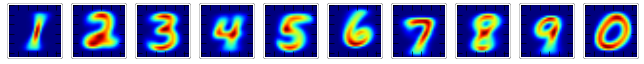

naive-bayes
===========

Naive Bayes implementation with digit recognition sample

## Requirement
- numpy
- scipy
- matplotlib

## Test
	$ python naive_bayes_test.py

## Digit recognition using MNIST dataset
	$ python mnist_digit_recognition.py

### After training
mean of Gaussians

### Result
0.7358 (7358/10000)

Note that it spends about an hour to test 10000 exapmles in this simple implementation.